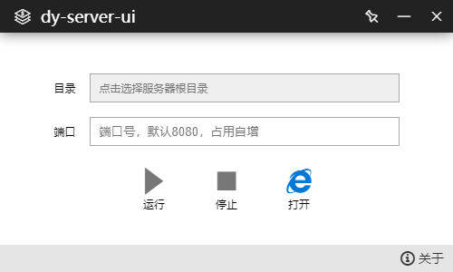

# dy-server-ui

dy-server-ui是基于electron开发的桌面应用程序，内部集成了dy-server静态资源服务器，可用于前端项目预览以及局域网文件下载。

### 使用步骤

1.克隆该仓库
```
git clone https://github.com/RilyZhang/dy-server-ui

cd dy-server-ui
```

2.安装依赖
```
npm i
```

中国区域可以使用cnpm来提高安装速度

```
cnpm i
```

3.启动
```
npm start
```

示例图



4.打包

如果不想使用npm start来启动项目，可以直接将项目打包为桌面应用：

```
npm build
```

命令执行后，在项目目录中会生成打包后的文件夹。

### 其他

静态资源服务器由dy-server提供支持，<a href="https://github.com/RilyZhang/dy-server" target="_blank">点击跳转</a>。

喜欢该项目的话请点击star。
